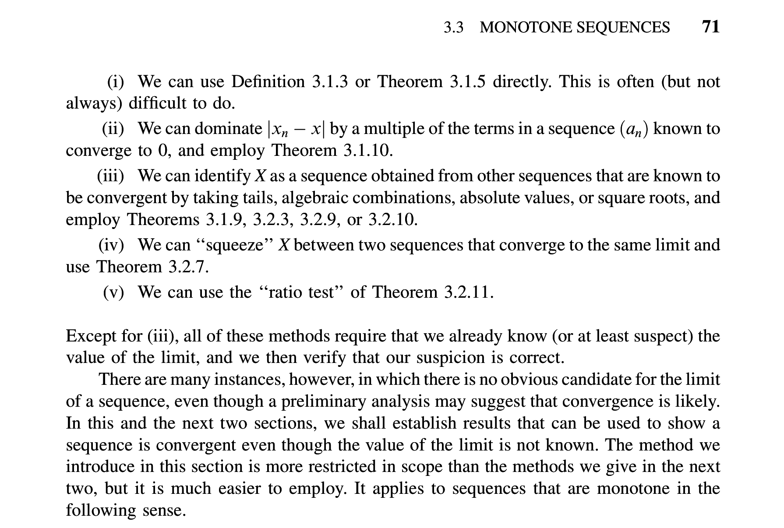

Have you ever found yourself reading chapter 10 of a math text and the author
references some corollary 4.2.0 from chapter 4? The flow of reading is
completely disrupted by having to scroll back and find what the heck corollary
4.2.0 is.

Bolzano is an attempt to write a better PDF viewer for reading math textbooks.
It is currently in a very nascent phase, written hastily, and mostly an
exploration of [libmupdf](https://github.com/ArtifexSoftware/mupdf) and SDL2.
There is much to improve. Bolzano aims to be a minimal PDF reader with these
features:

* vi keybinds
* Dual page view for wide monitors
* Jump to theorem, definition, example, etc.
* LaTeX annotations

Here is a demo where we pop open a viewport to peek at some theorems.

